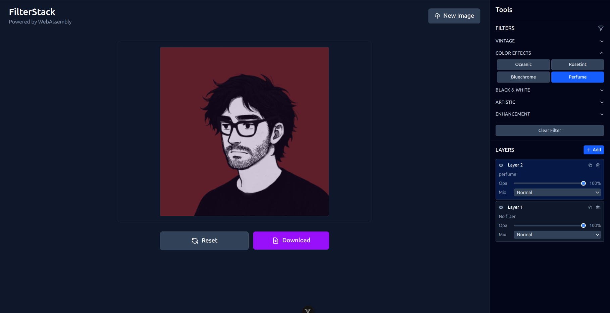

# FilterStack
A photo editing app with layered filters that runs entirely in your browser. Transform your images with multiple filter layers, blend modes, and opacity controls without uploading them to the cloud.



## Technologies Used

- **Vue 3** - Progressive JavaScript framework
- **TypeScript** - Type-safe JavaScript development
- **Pinia** - State management for Vue
- **Tailwind CSS** - Utility-first CSS framework
- **WebAssembly** - High-performance image processing
- **@silvia-odwyer/photon** - WebAssembly-based image filtering library
- **Vite** - Fast build tool and development server

## Features

- **Layer System**: Apply multiple filters on separate layers
- **Blend Modes**: Normal, Multiply, Screen, and Overlay blending
- **Opacity Control**: Individual opacity adjustment for each layer
- **Filter Groups**: Organized filter categories (Vintage, Color Effects, B&W, Artistic, Enhancement)
- **Privacy First**: All processing happens locally in your browser
- **Professional UI**: Photoshop-inspired interface with fixed sidebar
- **Responsive Design**: Works on desktop and mobile devices

## Project Structure

```
src/
├── components/
│   ├── ImageEditor.vue       # Main editor component
│   ├── ImageUpload.vue       # File upload interface
│   ├── LayersPanel.vue       # Layer management panel
│   └── FilterGroupsPanel.vue # Filter selection panel
├── composables/
│   ├── use-canvas.ts         # Canvas operations and layer rendering
│   └── use-reader.ts         # File reading utilities
├── stores/
│   └── image.ts              # Pinia store for state management
├── assets/
│   └── main.css              # Global styles and Tailwind imports
└── App.vue                   # Root component
```

## Getting Started

### Prerequisites

- Node.js (version 16 or higher)
- npm or yarn package manager

### Installation

1. Clone the repository:
```bash
git clone <repository-url>
cd FilterStack
```

2. Install dependencies:
```bash
npm install
```

3. Start the development server:
```bash
npm run dev
```

4. Open your browser and navigate to `http://localhost:5173`

### Building for Production

1. Build the application:
```bash
npm run build
```

2. Preview the production build:
```bash
npm run preview
```

The built files will be in the `dist/` directory, ready for deployment to any static hosting service.

## How to Use

1. **Upload an Image**: Drag and drop an image file or click to select one
2. **Add Layers**: Click "Add" in the Layers panel to create a new layer
3. **Apply Filters**: Select a layer, then choose filters from the organized groups
4. **Adjust Properties**: Use opacity sliders and blend mode dropdowns to fine-tune effects
5. **Layer Management**: Toggle visibility, duplicate, or delete layers as needed
6. **Export**: Click "Download" to save your edited image

## Filter Categories

- **Vintage**: vintage, sepia, golden
- **Color Effects**: oceanic, rosetint, bluechrome, perfume
- **Black & White**: grayscale, dramatic, firenze
- **Artistic**: oil, frosted, pastel_pink
- **Enhancement**: inc_brightness, inc_contrast, sharpen

## Contributing

1. Fork the repository
2. Create a feature branch: `git checkout -b feature-name`
3. Make your changes and commit: `git commit -m 'Add feature'`
4. Push to the branch: `git push origin feature-name`
5. Submit a pull request

## License

This project is licensed under the MIT License.

## Acknowledgments

- [Photon](https://github.com/silvia-odwyer/photon) - WebAssembly image processing library
- [Vue.js](https://vuejs.org/) - The progressive JavaScript framework
- [Tailwind CSS](https://tailwindcss.com/) - Utility-first CSS framework
- [Zero to Mastery](https://zerotomastery.io/) - Zero to Mastery
